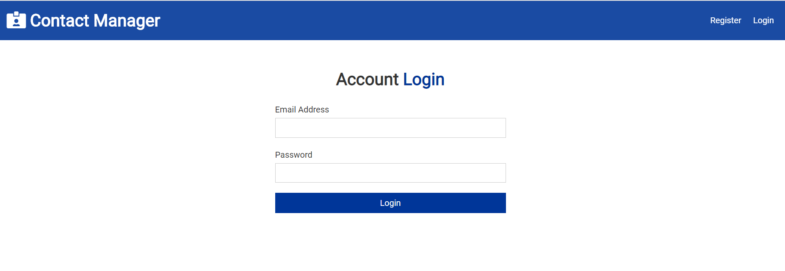
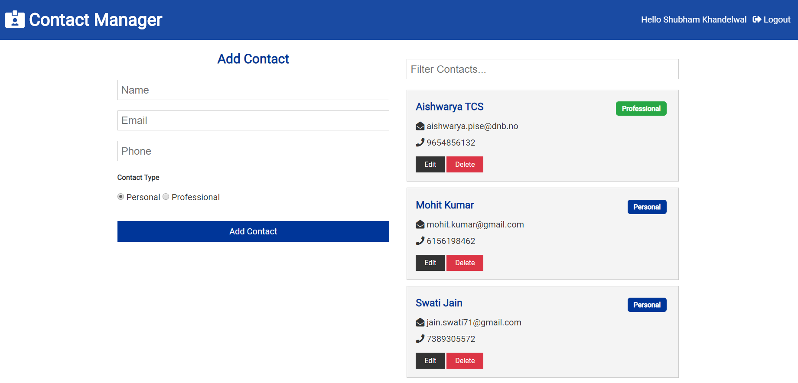

# Contact Manager

> Full stack MERN contact manager with React hooks, context & JWT authentication.

#### Login -



#### Dashboard -



## Usage

Install dependencies

```bash
npm install
cd client
npm install
```

### Mongo connection setup

Edit your /config/default.json file to include the correct MongoDB URI

### Run Server

```bash
npm run dev     # Express & React :3000 & :5000
npm run server  # Express API Only :5000
npm run client  # React Client Only :3000
```
